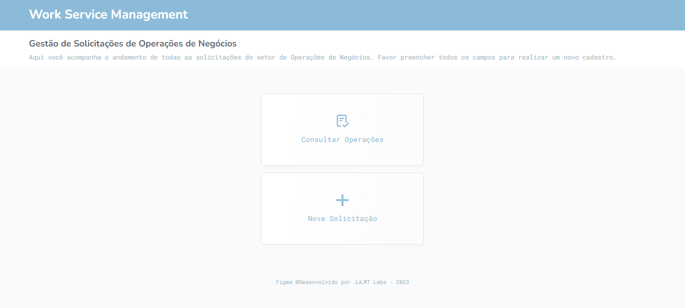
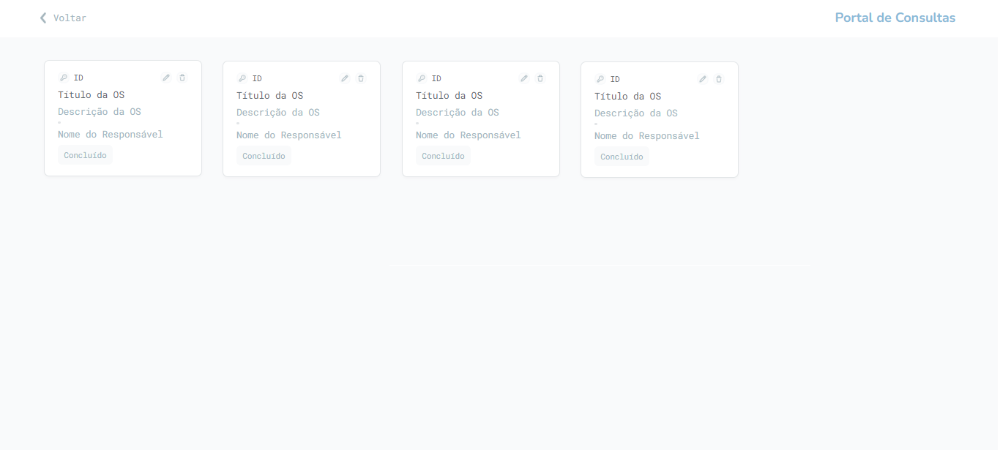
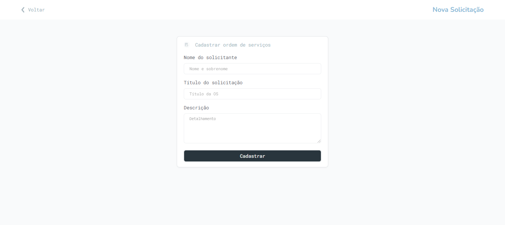

### Projeto UC9
# Gestão de Ordem de Serviços

## Sobre
Projeto desenvolvido para o curso de técnico de informática em internet do Senac sob orientação e instrução do professor [@Rusley Santos](https://github.com/rusleysantos).
Sistema simples desenvolvido para gestão de ordem de serviços, esse sistema incorpora o consumo de api’s e CRUD completo, como requisitos básicos o usuário pode criar, consultar, atualizar e deletar solicitações de serviços. O objetivo é automatizar o gerenciamento de ordens de serviços inteiramente permitindo equipes criarem, atribuirem, priorizarem e acompanharem as ordens de serviço do começo ao fim da sua vida útil.

## 🤖 Funcionalidades
- Login
- CRUD
- Banco de Dados
- Integração com API

## 🛠 Ferramentas utilizadas
- Figma
- HTML5
- CSS3
- Typescript
- React
- NextJs
- Postman
- Git
- Java e Java Spring Boot

## 📋 Documentação

| #    | Páginas        | Deploy |
| :--- | :------------- | :------ |
| `01` | `Protótipos Figma` |[🔗](https://www.figma.com/file/0AV5Pi51QiWcBzXZfPq16a/Work-Order-Mangement?type=design&node-id=0%3A1&mode=design&t=eODTzVgxLC0Yx2eK-1) |
| `02` | `Login` |
| `03` | `Home` |
| `04` | `Página de Consultas` |
| `05` | `Página de Cadastro` |

## Autores
#### [@Manoel Junior](https://github.com/Flickler)
#### [@Talita Costa](https://github.com/tltco)
#### [@Jean Costa](https://github.com/Janp3)
#### [@Matheus](https://github.com/)
#### [@Luiz Felipe](https://github.com/)
